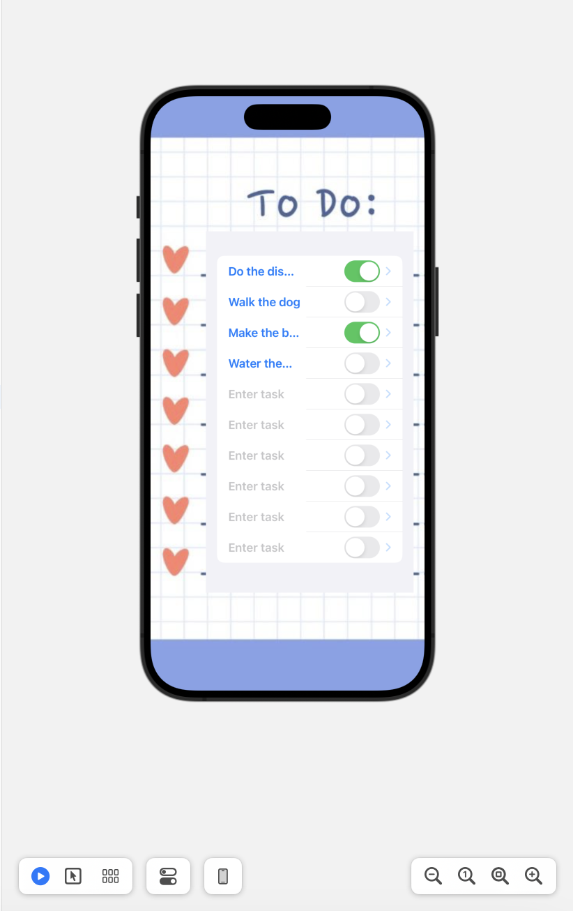
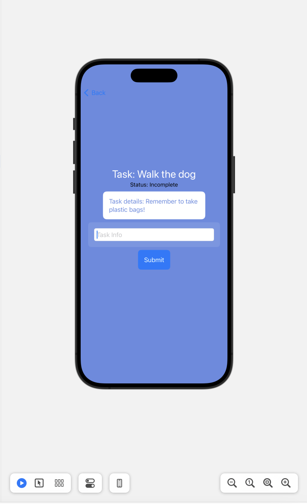

# TO DO list 

Overview
Challenge Source: Makers Bootcamp
Project Type: ios To Do List Application
Features: Create a todo list, toggle on tasks that have been done, click on task to read and add a description for that specific task.

## Tech Stack

- Swift
- SwiftUI

## Application

|   Description    |   Image    |
|:------------:|:----------------:|
|To Do list| |
|Task Page| |

